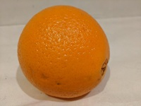

---
lab:
  title: Classifier des images
  description: "Utilisez le service Azure\_AI\_Custom\_Vision afin d’entraîner un modèle de classification d’images."
---

# Classifier des images

Le service **Azure AI Custom Vision** vous permet de créer des modèles de vision par ordinateur entraînés sur vos propres images. Vous pouvez l’utiliser pour effectuer l’apprentissage de modèles de *classification d’images* et de *détection d’objet*, que vous pouvez ensuite publier et consommer à partir de vos applications.

Dans cet exercice, vous allez utiliser le service Custom Vision pour effectuer l’apprentissage d’un modèle de classification d’images permettant d’identifier trois classes de fruits (pomme, banane et orange).

Bien que cet exercice repose sur le kit de développement logiciel (SDK) Python d’Azure Custom Vision, vous pouvez développer des applications de vision avec différents kits de développement logiciel (SDK) spécifiques à une langue, notamment :

* [Azure Custom Vision pour JavaScript (entraînement)](https://www.npmjs.com/package/@azure/cognitiveservices-customvision-training)
* [Azure Custom Vision pour JavaScript (prédiction)](https://www.npmjs.com/package/@azure/cognitiveservices-customvision-prediction)
* [Azure Custom Vision pour Microsoft .NET (entraînement)](https://www.nuget.org/packages/Microsoft.Azure.CognitiveServices.Vision.CustomVision.Training/)
* [Azure Custom Vision pour Microsoft .NET (prédiction)](https://www.nuget.org/packages/Microsoft.Azure.CognitiveServices.Vision.CustomVision.Prediction/)
* [Azure Custom Vision pour Java (entraînement)](https://search.maven.org/artifact/com.azure/azure-cognitiveservices-customvision-training/1.1.0-preview.2/jar)
* [Azure Custom Vision pour Java (prédiction)](https://search.maven.org/artifact/com.azure/azure-cognitiveservices-customvision-prediction/1.1.0-preview.2/jar)

Cet exercice prend environ **45** minutes.

## Créer des ressources Custom Vision

Avant de pouvoir effectuer l’apprentissage d’un modèle, vous avez besoin de ressources Azure de *formation* et de *prédiction*. Vous pouvez créer des ressources **Custom Vision** pour chacune de ces tâches, ou créer une ressource unique et l’utiliser pour les deux. Dans cet exercice, vous allez créer des ressources **Custom Vision** pour l’entraînement et la prédiction.

1. Ouvrez le [portail Azure](https://portal.azure.com) à l’adresse `https://portal.azure.com`, puis connectez-vous avec vos informations d’identification Azure. Fermez tous les messages de bienvenue ou conseils qui s’affichent.
1. Sélectionnez **Créer une ressource**.
1. Dans la barre de recherche, recherchez `Custom Vision`, sélectionnez **Custom Vision**, et créez la ressource avec les paramètres suivants :
    - **Options de création** : Les deux
    - **Abonnement** : *votre abonnement Azure*
    - **Groupe de ressources** : *créez ou sélectionnez un groupe de ressources*
    - **Région** : *choisissez n’importe quelle région disponible*
    - **Nom** : *un nom valide pour votre ressource Custom Vision*
    - **Niveau tarifaire de formation** : F0
    - **Niveau tarifaire de prédiction** : F0

1. Créez la ressource et attendez que le déploiement soit terminé, puis affichez les détails du déploiement. Notez que deux ressources Custom Vision sont provisionnées ; une pour l’entraînement, et une autre pour la prédiction.

    > **Remarque** : Chaque ressource a son propre *point de terminaison* et *ses propres clés*, qui sont utilisées pour gérer l’accès à partir de votre code. Pour effectuer l’apprentissage d’un modèle de classification d’images, votre code doit utiliser la ressource de *formation* (avec son point de terminaison et sa clé) ; si vous souhaitez utiliser le modèle formé pour prédire les classes d’images, votre code doit utiliser la ressource de *prédiction* (avec son point de terminaison et sa clé).

1. Une fois les ressources déployées, accédez au groupe de ressources pour les afficher. Vous devriez voir deux ressources Custom Vision, dont l’une avec le suffixe ***-Prédiction***.

## Créez un projet Custom Vision dans le portail Custom Vision.

Pour effectuer l’apprentissage d’un modèle de classification d’images, vous devez créer un projet Custom Vision basé sur votre ressource de formation. Pour ce faire, vous allez utiliser le portail Custom Vision.

1. Ouvrez un nouvel onglet de navigateur (en gardant l’onglet du portail Azure ouvert. Vous y reviendrez plus tard).
1. Dans le nouvel onglet, ouvrez le [portail Custom Vision](https://customvision.ai) à l’adresse `https://customvision.ai`. Si vous y êtes invité, connectez-vous en utilisant vos informations d’identification Azure et acceptez les conditions d’utilisation du service.
1. Dans le portail Custom Vision, créez un nouveau projet avec les paramètres suivants :
    - **Nom :** `Classify Fruit`
    - **Description** : `Image classification for fruit`
    - **Ressource** : *votre ressource Custom Vision*
    - **Types de projets** : Classification
    - **Types de classification** : Multiclasse (une balise par image)
    - **Domaines** : Nourriture

### Charger et étiqueter des images

1. Dans un nouvel onglet de navigateur, téléchargez les [images d’entraînement](https://github.com/MicrosoftLearning/mslearn-ai-vision/raw/main/Labfiles/image-classification/training-images.zip) depuis `https://github.com/MicrosoftLearning/mslearn-ai-vision/raw/main/Labfiles/image-classification/training-images.zip` et extrayez le dossier compressé pour en afficher le contenu. Ce dossier contient des sous-dossiers d’images de pommes, de bananes et d’oranges.
1. Dans le portail Custom Vision, au sein de votre projet de classification d’images, cliquez sur **Ajouter des images**, puis sélectionnez tous les fichiers du dossier **training-images/apple** que vous avez téléchargés et extraits précédemment. Chargez ensuite les fichiers d’images en spécifiant l’étiquette `apple`, comme suit :

    

1. Utilisez l’icône de barre d’outils **Ajouter des images** (**[+]**) pour répéter l’étape précédente et charger les images du dossier **banana** avec l’étiquette `banana`, puis les images du dossier **orange** avec l’étiquette `orange`.
1. Explorez les images que vous avez chargées dans le projet Custom Vision. Il doit y avoir 15 images de chaque classe, comme suit :

    

### Effectuer l’apprentissage d’un modèle

1. Dans le projet Custom Vision, au-dessus des images, cliquez sur **Entraîner** (&#9881;<sub>&#9881;</sub>) afin d’entraîner un modèle de classification à l’aide des images étiquetées. Sélectionnez l’option **Entraînement rapide**, puis attendez la fin de l’itération de formation (cette opération peut prendre une minute).
1. Une fois la formation de l’itération de modèle terminée, examinez les métriques de performance *Précision*, *Rappel* et *AP* : elles mesurent la précision de la prédiction du modèle de classification et doivent toutes être élevées.

    

> **Remarque** : Les métriques de performances sont basées sur un seuil de probabilité de 50 % pour chaque prédiction (en d’autres termes, si le modèle calcule une probabilité de 50 % ou supérieure qu’une image est d’une classe particulière, alors cette classe est prédite). Vous pouvez ajuster ce seuil en haut à gauche de la page.

### Tester le modèle

1. Au-dessus des métriques de performances, cliquez sur **Test rapide**.
1. Dans la zone **URL de l’image**, tapez `https://aka.ms/test-apple`, puis cliquez sur le bouton *Test rapide de l’image (&#10132;)* .
1. Vérifiez les prédictions retournées par votre modèle. Le score de probabilité pour *apple* devrait être le plus élevé, comme ceci :

    

1. Vous pouvez maintenant tester le modèle avec les images suivantes :
    - `https://aka.ms/test-banana`
    - `https://aka.ms/test-orange`

1. Fermez la fenêtre **Test rapide**.

### Afficher les paramètres du projet

Le projet que vous avez créé a été affecté à un identificateur unique, que vous devez spécifier dans n’importe quel code qui interagit avec celui-ci.

1. Cliquez sur l’icône *Paramètres* (&9881;) en haut à droite de la page **Performances** pour afficher les paramètres du projet.
1. Sous **Général** (à gauche), notez l’**ID de projet** qui identifie ce projet de façon unique.
1. La clé et le point de terminaison s’affichent à droite, sous la section **Ressources**. Vous y trouverez les détails de la ressource de *formation* (vous pouvez également obtenir ces informations en consultant la ressource dans le Portail Azure).

## Utiliser l’API de *formation*

Le portail Custom Vision fournit une interface utilisateur pratique que vous pouvez utiliser non seulement pour charger et marquer des images, mais également pour effectuer l’apprentissage de modèles. Toutefois, dans certains scénarios, vous aurez peut-être intérêt à automatiser la formation de modèles à l’aide de l’API de formation Custom Vision.

### Préparer la configuration de l’application

1. retournez à l’onglet du navigateur contenant le portail Azure (en gardant ouvert l’onglet du portail Custom Vision. Vous y reviendrez plus tard).
1. Dans le portail Azure, utilisez le bouton **[\>_]**, situé à droite de la barre de recherche en haut de la page, pour créer un nouveau Cloud Shell dans le portail Azure, en sélectionnant un environnement ***PowerShell*** sans stockage dans votre abonnement.

    Cloud Shell fournit une interface de ligne de commande via un volet situé en bas du portail Azure.

    > **Remarque** : si vous avez déjà créé un Cloud Shell qui utilise un environnement *Bash*, basculez-le vers ***PowerShell***.

    > **Remarque** : si le portail sollicite la sélection d’un stockage pour la persistance des fichiers, sélectionnez **Aucun compte de stockage requis**, choisissez l’abonnement concerné et validez avec **Appliquer**.

1. Dans la barre d’outils Cloud Shell, dans le menu **Paramètres**, sélectionnez **Accéder à la version classique** (cela est nécessaire pour utiliser l’éditeur de code).

    **<font color="red">Assurez-vous d’avoir basculé vers la version classique du Cloud Shell avant de continuer.</font>**

1. Redimensionnez la taille du volet Cloud Shell pour optimiser votre espace de travail.

    > **Conseil** : vous pouvez redimensionner le volet en faisant glisser la bordure supérieure. Vous pouvez également utiliser les boutons de réduction et d’agrandissement pour alterner entre le Cloud Shell et l’interface principale du portail.

1. Dans le volet Cloud Shell, saisissez les commandes suivantes pour cloner le référentiel GitHub contenant les fichiers de code pour cet exercice (saisissez la commande, ou copiez-la dans le presse-papiers puis effectuez un clic droit dans la ligne de commande pour la coller en texte brut) :

    ```
    rm -r mslearn-ai-vision -f
    git clone https://github.com/MicrosoftLearning/mslearn-ai-vision
    ```

    > **Conseil** : lorsque vous collez des commandes dans cloudshell, la sortie peut prendre une grande quantité de mémoire tampon d’écran. Vous pouvez effacer le contenu de l’écran en saisissant la commande `cls` pour faciliter le focus sur chaque tâche.

1. Une fois le clonage du référentiel terminé, utilisez la commande ci-dessous pour naviguer jusqu’aux fichiers de code de l’application :

    ```
   cd mslearn-ai-vision/Labfiles/image-classification/python/train-classifier
   ls -a -l
    ```

    Le dossier contient les fichiers de code et de configuration de votre application. Vous y trouverez aussi un sous-dossier **/more-training-images**, qui contient des fichiers image que vous allez utiliser pour effectuer un entraînement supplémentaire de votre modèle.

1. Installez le kit de développement logiciel (SDK) Azure AI Custom Vision pour l’entraînement et les éventuels autres packages requis à l’aide des commandes ci-dessous :

    ```
   python -m venv labenv
   ./labenv/bin/Activate.ps1
   pip install -r requirements.txt azure-cognitiveservices-vision-customvision
    ```

1. Saisissez la commande suivante pour modifier le fichier de configuration de votre application :

    ```
   code .env
    ```

    Le fichier s’ouvre dans un éditeur de code.

1. Dans le fichier de code, mettez à jour les valeurs de configuration qu’il contient afin de refléter le **point de terminaison** et la **clé** d’authentification de votre ressource *d’entraînement* Custom Vision, ainsi que l’**ID de projet** du projet Custom Vision que vous avez créé précédemment.
1. Une fois les espaces réservés remplacés, utilisez la commande **CTRL+S** dans l’éditeur de code pour enregistrer vos modifications, puis la commande **CTRL+Q** pour fermer l’éditeur tout en gardant la ligne de commande Cloud Shell ouverte.

### Écrivez du code pour effectuer l’entraînement du modèle.

1. Dans la ligne de commande cloud shell, saisissez la commande suivante pour ouvrir le fichier de code de l’application cliente :

    ```
   code train-classifier.py
    ```

1. Notez les détails suivants dans le fichier de code :
    - Les espaces de noms du kit de développement logiciel (SDK) Azure AI Custom Vision sont importés.
    - La fonction **Main** récupère les paramètres de configuration et utilise la clé et le point de terminaison pour créer une authentification.
    - **CustomVisionTrainingClient**, qui est ensuite utilisé avec l’ID de projet pour créer une référence **Projet** à votre projet.
    - La fonction **Upload_Images** récupère les balises définies dans le projet Custom Vision, puis charge les fichiers image à partir de dossiers ayant un nom correspondant dans le projet, en affectant l’ID de balise approprié.
    - La fonction **Train_Model** crée une nouvelle itération de formation pour le projet et attend la fin de la formation.

1. Fermez l’éditeur de code (*CTRL+Q*) et saisissez la commande suivante pour exécuter le programme :

    ```
   python train-classifier.py
    ```

1. Attendez la fin de l’exécution du programme. Retournez ensuite à l’onglet du navigateur contenant le portail Custom Vision et ouvrez la page **Images d’entraînement** de votre projet (rafraîchissez le navigateur si besoin).
1. Vérifiez que certaines nouvelles images étiquetées ont été ajoutées au projet. Affichez ensuite la page **Performances** et vérifiez qu’une nouvelle itération a été créée.

## Utilisez le classifieur d’images dans une application cliente.

Vous êtes maintenant prêt à publier votre modèle entraîné et à l’utiliser dans une application cliente.

### Publier le modèle de classification d’images

1. Sur le portail Custom Vision, sur la page **Performances**, cliquez sur **&#128504; Publier** pour publier le modèle formé avec les paramètres suivants :
    - **Nom du modèle** : `fruit-classifier`
    - **Ressource de prédiction** : *ressource de **prédiction** que vous avez créée précédemment et qui se termine par « -Prediction » (<u>autre que</u> la ressource de formation)* .
1. En haut à gauche de la page **Paramètres du projet**, cliquez sur l’icône *Galerie de projets* (&#128065;) pour revenir à la page d’accueil du portail Custom Vision, où votre projet est maintenant répertorié.
1. Sur la page d’accueil du portail Custom Vision, en haut à droite, cliquez sur l’icône *Paramètres* (&#9881;) pour afficher les paramètres de votre service Custom Vision. Ensuite, sous **Ressources**, recherchez votre ressource de *prédiction* qui se termine par « -Prediction » (<u>et non</u> la ressource de formation) pour indiquer ses valeurs de **Clé** et de **Point de terminaison** (vous pouvez également obtenir ces informations en affichant la ressource dans le Portail Azure).

### Utiliser le classifieur d’images à partir d’une application cliente

1. Retournez à l’onglet du navigateur contenant le portail Azure et le volet cloud shell.
1. Dans cloud shell, exécutez les commandes suivantes pour basculer vers le dossier de votre application cliente et afficher les fichiers qu’il contient :

    ```
   cd ../test-classifier
   ls -a -l
    ```

    Le dossier contient les fichiers de code et de configuration de votre application. Il contient également un sous-dossier **/test-images**, qui comporte des fichiers image que vous allez utiliser pour tester votre modèle.

1. Installez le kit de développement logiciel (SDK) Azure AI Custom Vision pour la prédiction et les éventuels autres packages requis à l’aide des commandes ci-dessous :

    ```
   python -m venv labenv
   ./labenv/bin/Activate.ps1
   pip install -r requirements.txt azure-cognitiveservices-vision-customvision
    ```

1. Saisissez la commande suivante pour modifier le fichier de configuration de votre application :

    ```
   code .env
    ```

    Le fichier s’ouvre dans un éditeur de code.

1. Mettez à jour les valeurs de configuration afin de refléter le **point de terminaison** et la **clé** de votre ressource de *<u>prédiction</u>* Custom Vision, l’**ID de projet** du projet de classification, ainsi que le nom de votre modèle publié (qui doit être *fruit-classifier*). Enregistrez vos modifications (*CTRL+S*) et fermez l’éditeur de code (*CTRL+Q*).
1. Dans la ligne de commande cloud shell, saisissez la commande suivante pour ouvrir le fichier de code de l’application cliente :

    ```
   code test-classifier.py
    ```

1. Passez en revue le code, en notant les détails suivants :
    - Les espaces de noms du kit de développement logiciel (SDK) Azure AI Custom Vision sont importés.
    - La fonction **Main** récupère les paramètres de configuration et utilise la clé et le point de terminaison pour créer un **CustomVisionPredictionClient** authentifié.
    - L’objet client de prédiction est utilisé pour prédire une classe pour chaque image dans le dossier **test-images**, en spécifiant l’ID de projet et le nom du modèle pour chaque requête. Chaque prédiction inclut une probabilité pour chaque classe possible, et seules les balises prédites ayant une probabilité supérieure à 50 % sont affichées.

1. Fermez l’éditeur de code et saisissez la commande suivante pour exécuter le programme :

    ```
   python test-classifier.py
    ```

    Le programme envoie chacune des images suivantes au modèle pour la classification :

    

    **IMG_TEST_1.jpg**

    <br/><br/>

    

    **IMG_TEST_2.jpg**

    <br/><br/>

    

    **IMG_TEST_3.jpg**

1. Affichez l’étiquette (balise) et les scores de probabilité pour chaque prédiction.

## Nettoyer les ressources

Lorsque vous avez terminé votre exploration d’Azure AI Custom Vision, il est recommandé de supprimer les ressources que vous avez créées au cours de cet exercice, afin de ne pas générer de frais superflus sur Azure :

1. Ouvrez le Portail Azure à l'adresse `https://portal.azure.com` et, dans la barre de recherche supérieure, recherchez les ressources que vous avez créées dans ce labo.

1. Dans la page de ressources, sélectionnez **Supprimer** et suivez les instructions pour supprimer la ressource. Vous pouvez également supprimer l’intégralité du groupe de ressources pour nettoyer toutes les ressources en même temps.
