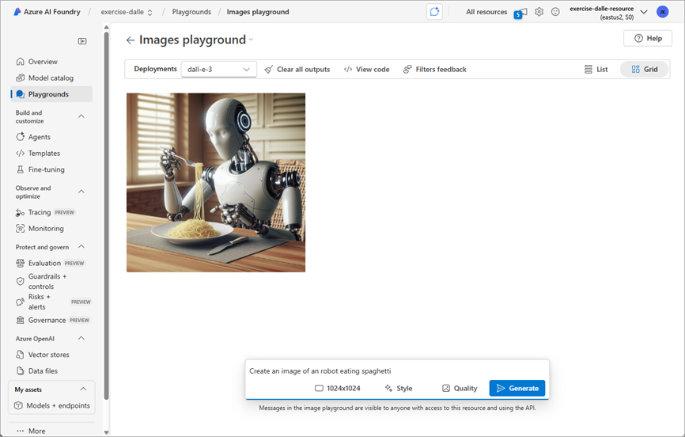

---
lab:
  title: Générer des images à l’aide de l’IA
  description: "Utilisez un modèle DALL-E d’OpenAI dans Azure\_AI\_Foundry afin de générer des images."
---

# Générer des images à l’aide de l’IA

Dans cet exercice, vous utilisez le modèle d’IA générative OpenAI DALL-E pour générer des images. Vous utilisez également le kit de développement logiciel (SDK) OpenAI pour Python afin de créer une application simple qui génère des images à partir de vos requêtes.

> **Remarque** : Cet exercice est basé sur une version préliminaire du logiciel SDK, qui est susceptible d'être modifiée. Le cas échéant, nous avons utilisé des versions spécifiques de certains packages, qui ne correspondent pas forcément aux versions les plus récentes disponibles. Il se peut que vous rencontriez des comportements, inattendus, des avertissements ou des erreurs.

Bien que cet exercice repose sur le kit de développement logiciel (SDK) OpenAI pour Python, vous pouvez développer des applications de conversation IA en utilisant plusieurs kits de développement logiciel (SDK) spécifiques à différentes langues, notamment :

* [Projets OpenAI pour Microsoft .NET](https://www.nuget.org/packages/OpenAI)
* [Projets OpenAI pour JavaScript](https://www.npmjs.com/package/openai)

Cet exercice prend environ **30** minutes.

## Ouvrir le portail Azure AI Foundry

Commençons par nous connecter au portail Azure AI Foundry.

1. Dans un navigateur web, ouvrez le [portail Azure AI Foundry](https://ai.azure.com) à l’adresse `https://ai.azure.com` et connectez-vous en utilisant vos informations d’identification Azure. Fermez les conseils ou les volets de démarrage rapide ouverts la première fois que vous vous connectez et, si nécessaire, utilisez le logo **Azure AI Foundry** en haut à gauche pour accéder à la page d’accueil, qui ressemble à l’image suivante (fermez le volet **Aide** s’il est ouvert) :

    

1. Examinez les informations sur la page d’accueil.

## Choisir un modèle pour démarrer un projet

Un *projet* Azure AI fournit un espace de travail collaboratif pour le développement de solutions d’IA. Commençons par choisir un modèle avec lequel nous voulons travailler, puis créons un projet pour l’utiliser.

> **Remarque** : les projets AI Foundry peuvent reposer sur une ressource *Azure AI Foundry*, qui donne accès à des modèles d’IA (y compris Azure OpenAI), aux services Azure AI et à d’autres ressources pour le développement d’assistants d’IA et de solutions de discussion. Les projets peuvent aussi être basés sur des ressources *Hub IA*, qui incluent des connexions aux ressources Azure pour le stockage sécurisé, la capacité de calcul et des outils spécialisés. Les projets fondés sur Azure AI Foundry conviennent parfaitement aux développeurs souhaitant gérer eux-mêmes les ressources pour le développement d’assistants d’IA ou d’applications de discussion. Les projets basés sur Hub IA sont plus adaptés aux équipes de développement en entreprise qui travaillent sur des solutions d’IA complexes.

1. Dans la page d’accueil, dans la section **Explorer les modèles et les fonctionnalités**, recherchez le modèle `dall-e-3` ; que nous utiliserons dans notre projet.

1. Dans les résultats de la recherche, sélectionnez le modèle **dall-e-3** pour consulter ses détails, puis, en haut de la page du modèle, sélectionnez **Utiliser ce modèle**.

1. Lorsque vous êtes invité à créer un projet, entrez un nom valide pour votre projet et développez les **options avancées**.

1. Sélectionnez **Personnaliser** et spécifiez les paramètres suivants pour votre hub :
    - **Ressource Azure AI Foundry** : *un nom valide pour votre ressource Azure AI Foundry.*
    - **Abonnement** : *votre abonnement Azure*
    - **Groupe de ressources** : *créez ou sélectionnez un groupe de ressources*
    - **Région** : *Sélectionnez n’importe quelle **recommandation d’AI Foundry***\*

    > \* Certaines ressources Azure AI sont limitées par des quotas de modèles régionaux. Si une limite de quota est atteinte plus tard dans l’exercice, vous devrez peut-être créer une autre ressource dans une autre région.

1. Sélectionnez **Créer** et attendez que votre projet, incluant le modèle déploiement dall-e-3 que vous avez choisi, soit créé.

    > Note : selon la sélection de votre modèle, vous pouvez recevoir des invites supplémentaires pendant le processus de création du projet. Acceptez les termes et finalisez le déploiement.

1. Lorsque votre projet est créé, votre modèle s’affiche dans la page **Modèles + points de terminaison**.

## Tester le modèle dans le terrain de jeu

Avant de créer une application cliente, testons le modèle DALL-E dans le terrain de jeu.

1. Sélectionnez **Terrains de jeu**, puis **Terrain de jeu images**.

1. Vérifiez que votre déploiement de modèle DALL-E est sélectionné. Ensuite, dans la zone située en bas de la page, saisissez une requête telle que `Create an image of an robot eating spaghetti` et sélectionnez **Générer**.

1. Passez en revue l’image résultante dans le terrain de jeu :

    

1. Saisissez une invite de suivi, telle que `Show the robot in a restaurant`, et examinez l'image obtenue.

1. Continuez à tester avec de nouvelles invites pour affiner l’image jusqu’à ce que vous soyez satisfait de celle-ci. 

1. Sélectionnez le bouton **\</\>Afficher le code** et assurez-vous de vous trouver sur l’onglet **Authentification Entra ID**. Enregistrez ensuite les informations suivantes pour une utilisation ultérieure dans l’exercice. Notez que les valeurs indiquées sont des exemples ; veillez à enregistrer les informations issues de votre propre déploiement.

    * Point de terminaison OpenAI : *https://dall-e-aus-resource.cognitiveservices.azure.com/*
    * Version de l’API OpenAI : *2024-04-01-preview*
    * Nom du déploiement (nom du modèle) : *dall-e-3*

## Créer une application cliente

Le modèle semble fonctionner dans le terrain de jeu. Vous pouvez désormais utiliser le kit de développement logiciel (SDK) OpenAI afin de l’exploiter dans une application cliente.

### Préparer la configuration de l’application

1. Ouvrez un nouvel onglet de navigateur (en gardant le portail Azure AI Foundry ouvert dans l’onglet existant). Dans un nouvel onglet du navigateur, ouvrez le [portail Azure](https://portal.azure.com) à l’adresse `https://portal.azure.com` et connectez-vous en utilisant vos informations d’identification Azure.

1. Cliquez sur le bouton **[\>_]** à droite de la barre de recherche, en haut de la page, pour créer un environnement Cloud Shell dans le portail Azure, puis sélectionnez un environnement ***PowerShell***. Cloud Shell fournit une interface de ligne de commande dans un volet situé en bas du portail Azure.

    > **Remarque** : si vous avez déjà créé un Cloud Shell qui utilise un environnement *Bash*, basculez-le vers ***PowerShell***.

    > **Remarque** : si le portail sollicite la sélection d’un stockage pour la persistance des fichiers, sélectionnez **Aucun compte de stockage requis**, choisissez l’abonnement concerné et validez avec **Appliquer**.

1. Dans la barre d’outils Cloud Shell, dans le menu **Paramètres**, sélectionnez **Accéder à la version classique** (cela est nécessaire pour utiliser l’éditeur de code).

    **<font color="red">Assurez-vous d’avoir basculé vers la version classique du Cloud Shell avant de continuer.</font>**

1. Dans le volet Cloud Shell, saisissez les commandes suivantes pour cloner le référentiel GitHub contenant les fichiers de code pour cet exercice (saisissez la commande, ou copiez-la dans le presse-papiers puis effectuez un clic droit dans la ligne de commande pour la coller en texte brut) :

    ```
    rm -r mslearn-ai-vision -f
    git clone https://github.com/MicrosoftLearning/mslearn-ai-vision
    ```

    > **Conseil** : lorsque vous collez des commandes dans cloudshell, la sortie peut prendre une grande quantité de mémoire tampon d’écran. Vous pouvez effacer le contenu de l’écran en saisissant la commande `cls` pour faciliter le focus sur chaque tâche.

1. Une fois le référentiel cloné, accédez au dossier contenant les fichiers de code de l’application :  

    ```
   cd mslearn-ai-vision/Labfiles/dalle-client/python
    ```

1. Dans le volet de ligne de commande Cloud Shell, saisissez la commande suivante pour installer les bibliothèques que vous utiliserez, c’est-à-dire :

    ```
   python -m venv labenv
   ./labenv/bin/Activate.ps1
   pip install -r requirements.txt azure-identity openai requests
    ```

1. Saisissez la commande suivante pour modifier le fichier de configuration fourni :

    ```
   code .env
    ```

    Le fichier s’ouvre dans un éditeur de code.

1. Remplacez les espaces réservés **your_endpoint**, **your_model_deployment** et **your_api_version** par les valeurs que vous avez notées à partir de **Terrain de jeu images**.

1. Une fois que vous avez remplacé les espaces réservés, utilisez la commande **Ctrl+S** pour enregistrer vos modifications, puis utilisez la commande **Ctrl+Q** pour fermer l’éditeur de code tout en gardant la ligne de commande Cloud Shell ouverte.

### Écrire du code pour vous connecter à votre projet et converser avec votre modèle

> **Conseil** : lorsque vous ajoutez du code, veillez à conserver la mise en retrait correcte.

1. Saisissez la commande suivante pour modifier le fichier de code fourni :

    ```
   code dalle-client.py
    ```

1. Dans le fichier de code, notez les instructions existantes qui ont été ajoutées en haut du fichier pour importer les espaces de noms SDK nécessaires. Ensuite, sous le commentaire **Ajouter des références**, ajoutez le code suivant pour référencer les espaces de noms dans les bibliothèques que vous avez installées précédemment :

    ```python
   # Add references
   from dotenv import load_dotenv
   from azure.identity import DefaultAzureCredential, get_bearer_token_provider
   from openai import AzureOpenAI
   import requests
    ```

1. Dans la fonction **main**, sous le commentaire **Voir les paramètres de configuration**, observez que le code charge le point de terminaison, la version de l’API et le nom du modèle de déploiement que vous avez définis dans le fichier de configuration.

1. Sous le commentaire **Initialiser le client**, ajoutez le code suivant afin d’établir la connexion à votre modèle en utilisant les informations d’identification Azure de la session à laquelle vous êtes actuellement connecté :

    ```python
   # Initialize the client
   token_provider = get_bearer_token_provider(
       DefaultAzureCredential(exclude_environment_credential=True,
           exclude_managed_identity_credential=True), 
       "https://cognitiveservices.azure.com/.default"
   )
    
   client = AzureOpenAI(
       api_version=api_version,
       azure_endpoint=endpoint,
       azure_ad_token_provider=token_provider
   )
    ```

1. Notez que le code inclut une boucle pour permettre à un utilisateur d’entrer une invite jusqu’à ce qu’il entre « quitter ». Ensuite, dans la section de boucle, sous le commentaire **Générer une image**, ajoutez le code suivant pour soumettre l'invite et récupérer l'URL de l'image générée à partir de votre modèle :

    **Python**

    ```python
   # Generate an image
   result = client.images.generate(
        model=model_deployment,
        prompt=input_text,
        n=1
    )

   json_response = json.loads(result.model_dump_json())
   image_url = json_response["data"][0]["url"] 
    ```

1. Notez que le code dans le reste de la fonction **main** transmet l’URL de l’image et un nom de fichier à une fonction fournie, qui télécharge l’image générée et l’enregistre sous forme de fichier .png.

1. Utilisez la commande **Ctrl+S** pour enregistrer vos modifications dans le fichier de code, puis utilisez la commande **Ctrl+Q** pour fermer l’éditeur de code tout en gardant la ligne de commande Cloud Shell ouverte.

### Exécution de l’application cliente

1. Dans le volet de la ligne de commande Cloud Shell, entrez la commande suivante pour vous connecter à Azure.

    ```
   az login
    ```

    **<font color="red">Vous devez vous connecter à Azure, même si la session Cloud Shell est déjà authentifiée.</font>**

    > **Remarque** :dans la plupart des scénarios, l’utilisation d’*az login* suffit. Toutefois, si vous avez des abonnements dans plusieurs locataires, vous devrez peut-être spécifier le locataire à l’aide du paramètre *--tenant*. Pour plus d’informations, consultez [Se connecter à Azure de manière interactive à l’aide d’Azure CLI](https://learn.microsoft.com/cli/azure/authenticate-azure-cli-interactively).

1. Lorsque l’invite apparaît, suivez les instructions pour ouvrir la page de connexion dans un nouvel onglet et entrez le code d’authentification fourni ainsi que vos informations d’identification Azure. Effectuez ensuite le processus de connexion dans la ligne de commande, en sélectionnant l’abonnement contenant votre hub Azure AI Foundry si nécessaire.

1. Dans le volet de ligne de commande Cloud Shell, entrez la commande suivante pour exécuter l’application :

    ```
   python dalle-client.py
    ```

1. Lorsque vous y êtes invité, entrez une requête d'image, telle que `Create an image of a robot eating pizza`. Après quelques instants, l'application doit confirmer que l'image a été enregistrée.

1. Essayez quelques invites supplémentaires. Lorsque vous avez terminé, entrez `quit` pour quitter le programme.

    > **Remarque** : dans cette application simple, nous n'avons pas mis en place de logique pour conserver l'historique des conversations ; le modèle traitera donc chaque demande comme une nouvelle demande sans tenir compte du contexte de la demande précédente.

1. Pour télécharger et afficher les images générées par votre application, utilisez la commande de **téléchargement** Cloud Shell, en spécifiant le fichier PNG généré :

    ```
   download ./images/image_1.png
    ```

    La commande de téléchargement crée un lien contextuel en bas à droite de votre navigateur, que vous pouvez sélectionner pour télécharger et ouvrir le fichier.

## Résumé

Dans cet exercice, vous avez utilisé Azure AI Foundry et le SDK Azure OpenAI pour créer une application cliente utilisant un modèle DALL-E pour générer des images.

## Nettoyage

Si vous avez terminé d’explorer DALL-E, vous devez supprimer les ressources que vous avez créées dans cet exercice pour éviter d’entraîner des coûts Azure inutiles.

1. Revenez à l’onglet du navigateur contenant le portail Azure (ou ouvrez à nouveau le [portail Azure](https://portal.azure.com) à l’adresse `https://portal.azure.com` dans un nouvel onglet de navigateur) et affichez le contenu du groupe de ressources dans lequel vous avez déployé les ressources utilisées dans cet exercice.
1. Dans la barre d’outils, sélectionnez **Supprimer le groupe de ressources**.
1. Entrez le nom du groupe de ressources et confirmez que vous souhaitez le supprimer.
